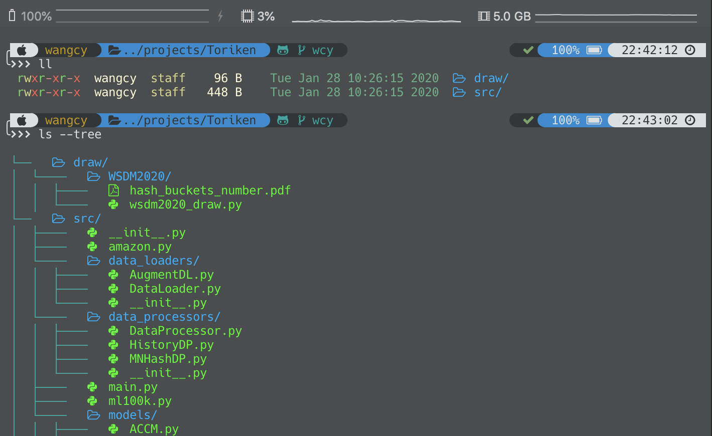

# dotfiles
My personal dotfiles for vim and zsh.

### Environments

- Shell: oh-my-zsh
- Terminal: iTerm2
- Color scheme: [Solarized Darcula](https://github.com/rickhanlonii/Solarized-Darcula)
- Theme: [Powerlevel9k](https://github.com/Powerlevel9k/powerlevel9k)
- Font: [Hack Nerd Font](https://www.nerdfonts.com/)
- Plugins: [zsh-autosuggestions](https://github.com/zsh-users/zsh-autosuggestions), [autojump](autojump)
- Optional: ruby, [colorls](https://github.com/athityakumar/colorls)

### Preview

