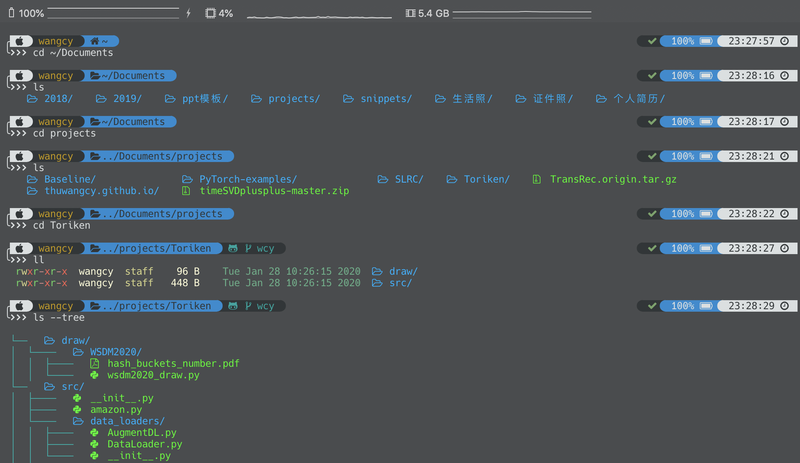

# dotfiles
My personal dotfiles for vim and zsh.

### Environments

- Shell: oh-my-zsh
  - Theme: [Powerlevel9k](https://github.com/Powerlevel9k/powerlevel9k)
  - Plugins: [autosuggestions](https://github.com/zsh-users/zsh-autosuggestions), [autojump](autojump)
  - Optional: ruby + [colorls](https://github.com/athityakumar/colorls)
- Terminal: iTerm2
  - Color Scheme: [Solarized Darcula](https://github.com/rickhanlonii/Solarized-Darcula)
  - Font: [Hack Nerd Font](https://www.nerdfonts.com/)

### Preview

